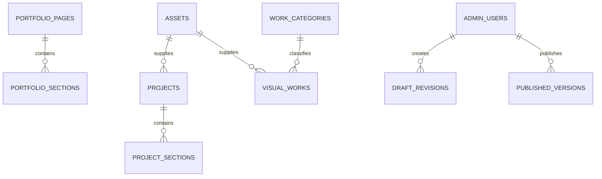

# Portfolio Admin data model

## Backend decision

Supabase is suitable for this portfolio scale because PostgreSQL handles ordered structured content and revisions, Storage handles local assets, Auth provides sessions, and Row Level Security can keep draft/admin data private. Production connection is intentionally deferred; the schema is defined now so UI and integration work share one contract.

Canonical PostgreSQL foundation: `supabase/migrations/20260831000000_portfolio_cms_foundation.sql`.

## Shared conventions

- Primary keys: UUID generated by PostgreSQL.
- Stable public selectors: page `slug`, section `section_key`, project `slug`, work/category `slug`.
- Ordering: non-negative integer `sort_order`; Admin exposes drag reorder, not a numeric field.
- Lifecycle: `publish_state = draft | published | archived`, plus `visible` where an ordered item may be hidden without archival.
- Timestamps: `created_at`, `updated_at`; revisions and published versions are immutable.
- Assets are referenced by UUID, never by a UI filename.
- Public Portfolio reads only the current immutable `published_versions.snapshot` in the first integration. It never reads draft rows.

## Entities

### `admin_users`

Purpose: Auth allowlist and authorization.

| Field | Required | Notes |
| --- | --- | --- |
| `user_id` | yes | FK `auth.users.id`, PK |
| `role` | yes | `editor` or `super_admin` |
| `active` | yes | revoked users fail authorization immediately |
| `created_at`, `updated_at` | yes | audit |

No account, password or private email is seeded.

### `portfolio_pages`

Purpose: top-level public pages and page-level metadata.

| Field | Required | Notes |
| --- | --- | --- |
| `id`, `slug`, `title` | yes | `slug` unique (`home`, `works`) |
| `seo_title`, `seo_description` | no | settings/editor contract |
| `publish_state` | yes | working lifecycle |
| `sort_order` | yes | Admin IA order |

### `portfolio_sections`

Purpose: Home section copy/config not represented by a repeating entity.

| Field | Required | Notes |
| --- | --- | --- |
| `page_id`, `section_key`, `label` | yes | unique `(page_id, section_key)` |
| `content` | yes | JSON object validated by application section schema |
| `sort_order`, `visible`, `publish_state` | yes | navigation/display state |

Content contracts:

```ts
type HeroContent = {
  eyebrow: string;
  title: { policy: "auto"; text: string } | { policy: "manual"; segments: string[] };
  description: string;
  period: string;
  disciplines: string[];
};

type AboutContent = {
  eyebrow: string;
  title: string;
  description: string;
  representativeAssetId: string;
  representativeAlt: string;
  representativeCaption?: string;
  objectPosition: ObjectPosition;
  capabilities: Array<{ id: string; number: string; title: string; description: string; sortOrder: number; visible: boolean }>;
};
```

Project supporting note, section headings and Contact copy/links also live here. Repeating project/work/career/workflow records remain normalized below.

### `projects`

Purpose: existing project card and detail overview.

| Field | Required | Notes |
| --- | --- | --- |
| `slug`, `number`, `title`, `subtitle` | yes | project identity |
| `year_label`, `project_type`, `summary`, `intro` | yes | current overview mapping |
| `roles`, `tools` | yes | text arrays |
| `hero_asset_id`, `hero_alt`, `hero_ratio`, `hero_tone` | yes | asset + current media semantics |
| `hero_caption`, `hero_object_position` | no/yes | caption optional, object position defaults center |
| `external_url` | no | HTTPS only at application validation |
| `show_on_home`, `sort_order`, `publish_state` | yes | home/project state |

V1 admin edits existing rows. Creating an arbitrary project route remains disabled until a template and slug review flow are approved.

### `project_sections`

Purpose: ordered project story blocks and gallery-aware future extension.

| Field | Required | Notes |
| --- | --- | --- |
| `project_id`, `section_key`, `label`, `title`, `body` | yes | unique key per project |
| `items` | yes | text array, may be empty |
| `sort_order`, `visible` | yes | drag reorder |

Project gallery media can initially remain in `portfolio_sections.content`/published snapshot; if gallery editing becomes complex, add a normalized `project_media` child table in a later migration. Avoid creating it before a real editor need.

### `work_categories`

Purpose: Works archive category label/order/frame policy.

| Field | Required | Notes |
| --- | --- | --- |
| `slug`, `name` | yes | both unique |
| `preview_type` | yes | `wide`, `square`, `detail`, `portrait` |
| `sort_order`, `visible` | yes | super admin managed |

Seed/migration order must preserve the current five categories:

1. 유튜브 썸네일
2. 자막·타이틀 디자인
3. 이벤트 배너
4. 쇼핑라이브 콘텐츠
5. 상세페이지

### `visual_works`

Purpose: card shown in Works and optionally Home.

| Field | Required | Notes |
| --- | --- | --- |
| `slug`, `title`, `category_id`, `asset_id`, `alt_text` | yes | stable card identity and media |
| `description`, `caption`, `external_link` | no | only when informative |
| `ratio`, `preview_type`, `object_fit`, `object_position` | yes | visual frame contract |
| `show_on_home`, `home_featured`, `sort_order`, `home_sort_order` | yes | archive/home ordering |
| `publish_state` | yes | public eligibility |

A partial unique index allows at most one `home_featured=true` row. Application validation also requires featured work to be published and shown on Home.

### `career_entries`

Purpose: ordered career timeline.

| Field | Required | Notes |
| --- | --- | --- |
| `entry_type` | yes | `career` or `personal_project` |
| `period`, `company`, `team`, `role`, `description` | yes | current rendering |
| `position` | no | retained from current data contract |
| `highlights` | yes | text array |
| `sort_order`, `visible`, `publish_state` | yes | timeline state |

LIVBEE uses `entry_type=personal_project`; no separate entity is needed.

### `workflow_entries`

Purpose: Design / Content / Commerce / Product rows.

| Field | Required | Notes |
| --- | --- | --- |
| `title`, `description`, `tools` | yes | tools text array |
| `sort_order`, `visible`, `publish_state` | yes | editor state |

### `assets`

Purpose: uploaded, imported or external media metadata and lifecycle.

| Field | Required | Notes |
| --- | --- | --- |
| `source_type` | yes | `upload`, `library`, `external` |
| `storage_path` or `external_url` | one | XOR check |
| `filename`, `mime_type`, `width`, `height`, `byte_size` | yes | validation and display |
| `alt_text`, `caption`, `category` | no | reusable defaults |
| `health_state`, `last_checked_at` | yes/no | external media health |
| `archived_at`, timestamps | no/yes | safe deletion workflow |

Usage count is calculated from references, not manually stored. Physical Storage deletion happens only after reference count is zero and retention policy passes.

### `draft_revisions`

Purpose: append-only field/entity audit and restore source.

| Field | Required | Notes |
| --- | --- | --- |
| `entity_type`, `entity_id` | yes | changed record |
| `before_data`, `after_data` | yes | JSON snapshots |
| `created_by`, `created_at` | yes | actor/time |
| `change_note` | no | publish/editor context |

### `published_versions`

Purpose: immutable public snapshot.

| Field | Required | Notes |
| --- | --- | --- |
| `version_number` | yes | monotonic unique number |
| `snapshot` | yes | complete public Portfolio contract |
| `source_revision_ids` | yes | UUID array for traceability |
| `published_by`, `published_at` | yes | audit |
| `is_current` | yes | one partial-unique current version |

Publishing transaction sets the previous current version false, inserts the validated snapshot, and marks the new version current. Rollback publishes a new version cloned from an old snapshot.

## Relations



## API / adapter contract

The UI imports a provider-neutral adapter; it does not call Supabase directly from every component.

```ts
interface PortfolioCmsAdapter {
  getWorkspace(): Promise<CmsWorkspace>;
  saveDraft(input: SaveDraftInput, expectedRevisionId?: string): Promise<SaveDraftResult>;
  getPreviewSnapshot(draftId: string): Promise<PortfolioSnapshot>;
  validateDraft(draftId: string): Promise<ValidationResult>;
  publish(draftId: string, expectedRevisionId: string): Promise<PublishedVersion>;
  listRevisions(entity: EntityRef): Promise<Revision[]>;
  restoreRevision(revisionId: string): Promise<SaveDraftResult>;
  listAssets(filter: AssetFilter): Promise<AssetPage>;
  uploadAsset(file: File, metadata: AssetInput): Promise<Asset>;
  reorder(entity: ReorderEntity, orderedIds: string[], expectedRevisionId: string): Promise<SaveDraftResult>;
}
```

Server Actions are preferred for Admin mutations; Server Components/provider methods are preferred for initial reads. External upload callbacks or webhooks use Route Handlers. Public rendering reads the current published snapshot server-side.

## Migration plan

1. Apply schema and RLS with no public read policy on draft tables.
2. Create one admin allowlist row manually after Auth account creation; never seed credentials.
3. Import current hardcoded data and local asset metadata in an idempotent script.
4. Generate and compare the first snapshot against current TypeScript data.
5. Connect Admin reads, then draft mutations, then preview.
6. Enable publish only after snapshot validation and full visual regression.
7. Replace public hardcoded reads one area at a time in the order defined by `ADMIN_FRONTEND_CONTRACT.md`.
